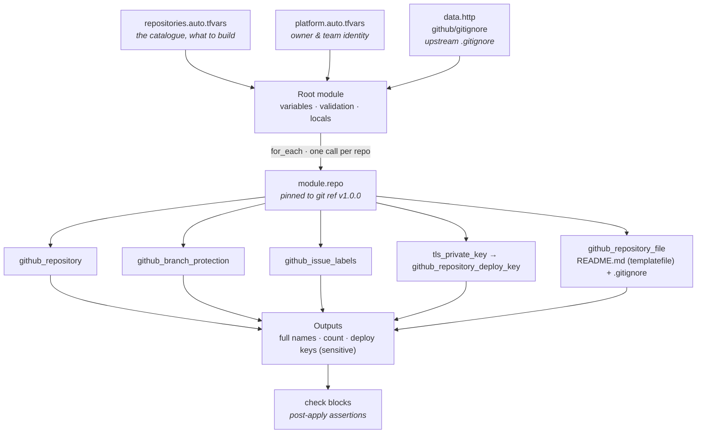

# repo-factory

**A self-service GitHub repository factory built with Terraform.** One block of config in, a fully governed repository out: branch protection, issue labels, a generated README, a synced `.gitignore`, and a read-only deploy key. No clicking through GitHub settings. No "who turned off branch protection on this repo?"

[](https://developer.hashicorp.com/terraform)
[](https://registry.terraform.io/providers/integrations/github/latest/docs)
[](https://developer.hashicorp.com/terraform/language)
[-FFDA18)](https://developer.hashicorp.com/certifications/infrastructure-automation)

---

## Table of contents

- [The 30-second version](#the-30-second-version)
- [Why I built this](#why-i-built-this)
- [What it actually does](#what-it-actually-does)
- [Architecture](#architecture)
- [How it works, piece by piece](#how-it-works-piece-by-piece)
- [How this taught me Terraform](#how-this-taught-me-terraform)
- [Getting started](#getting-started)
- [Design decisions and trade-offs](#design-decisions-and-trade-offs)
- [Why this pattern matters in the real world](#why-this-pattern-matters-in-the-real-world)
- [Roadmap: taking this to production](#roadmap-taking-this-to-production)
- [What I'd do differently](#what-id-do-differently)

---

## The 30-second version

Adding a new repository to the platform means adding roughly eight lines to a `.tfvars` file:

```hcl
"svc-billing" = {
  description        = "Billing service"
  topics             = ["service", "go", "terraform-managed"]
  required_reviewers = 1
  extra_labels = {
    "area/payments" = { color = "5319e7", description = "Payments subsystem" }
  }
}
```

`terraform apply`, and you get a repository named `repo-factory-svc-billing` that has:

| Concern | What the factory guarantees |
| --- | --- |
| **Naming** | Enforced `repo-factory-` prefix, validated as lowercase and URL-safe |
| **Branch protection** | No force pushes, no branch deletion, linear history required, stale reviews dismissed |
| **Code review** | Configurable required approvals (0-6, validated against GitHub's real limit) |
| **Triage** | Four org-standard issue labels on every repo, plus per-repo extras |
| **Documentation** | `README.md` generated from a template so it can never drift from the config |
| **Hygiene** | `.gitignore` pulled live from GitHub's official `Terraform.gitignore` |
| **CI access** | A freshly generated ED25519 read-only deploy key, exposed as a sensitive output |
| **Cleanup** | `delete_branch_on_merge`, wikis and projects off by default |

Three repositories are already defined in `repositories.auto.tfvars` as a working demonstration. Adding a fourth costs about thirty seconds.

---

## Why I built this

I was studying for the **HashiCorp Certified: Terraform Associate (004)** exam and hit the problem every certification candidate hits: the tutorials are all cloud-provider tutorials. Spin up an EC2 instance, attach a security group, destroy it before the free tier bills you. You learn the syntax, but you never learn *why* the language has the features it has, because the toy problem is too small to need them.

I wanted a project where the language features were **load-bearing** rather than decorative. So I picked a problem I'd actually watched go wrong in practice: **repository sprawl.**

Here's the failure mode. A team creates a new service repo by clicking "New repository." It's fine on day one. Then:

- Someone forgets to enable branch protection, so a bad commit lands directly on `main` at 2am.
- Repo names drift (`billing-svc`, `svc_billing`, `BillingService`), and every script that globs over repositories needs a special case.
- One repo requires two reviewers, its neighbour requires zero, and nobody can tell you which is correct or who decided.
- Issue labels are different colours and different names in every repo, so cross-repo triage is guesswork.
- A deploy key gets created by hand, pasted into CI, and is still valid three years after the engineer who made it left.

Every one of these is a *configuration* problem being solved by *human memory*. That is exactly the class of problem infrastructure as code exists to eliminate, and the insight that made this click for me is that **GitHub is infrastructure.** It has an API, it has resources with lifecycles, it has state that drifts. There is no reason it should be managed by hand when your VPCs aren't.

So the goal became: *make the correct way to create a repository also the easiest way.* If getting a governed repo is a `.tfvars` entry and getting an ungoverned one requires arguing with a reviewer, governance stops being a policy document and becomes a default.

Building it against the GitHub API rather than a cloud provider had a very practical side benefit too: **every resource in this project is free.** I could run `terraform apply` and `terraform destroy` dozens of times while learning, with no cloud bill and no fear of leaving a NAT gateway running over a weekend.

---

## What it actually does

In plain terms, there are two layers:

**Layer 1: the module (`modules/repo/`).** This is the opinionated blueprint for what "a repository at this company" means. It knows nothing about *which* repos exist. It takes a name and some settings and produces one correctly-configured repository. It's versioned and pinned, so changing the company standard is a deliberate, reviewable version bump, not something that silently happens on the next `apply`.

**Layer 2: the root configuration (`/`).** This is the catalogue. It holds the list of repositories the platform team owns, the labels every repo gets, and the naming convention. It calls the module once per repository using `for_each`.

The separation matters. A developer wanting a new repo edits **only** the catalogue, a data file. They never touch the logic that decides what branch protection looks like. That's the "self-service with guardrails" idea: the paved road is wide and easy, and stepping off it requires effort.

---

## Architecture



```
repo-factory/
├── versions.tf                 # Terraform + provider version constraints
├── providers.tf                # GitHub provider; token comes from the environment
├── variables.tf                # Typed inputs with validation rules
├── locals.tf                   # Derived values, the http data source, check blocks
├── main.tf                     # The single for_each module call
├── outputs.tf                  # Names, count, and sensitive deploy keys
├── platform.auto.tfvars        # Who owns these repos
├── repositories.auto.tfvars    # ← THE CATALOGUE. This is the file you edit.
├── .terraform.lock.hcl         # Committed on purpose. See below.
└── modules/repo/
    ├── versions.tf
    ├── variables.tf            # The module's contract
    ├── main.tf                 # Six resources = one governed repository
    ├── outputs.tf              # Eight outputs, including one sensitive
    └── templates/
        └── README.md.tftpl     # Generated README for every managed repo
```

---

## How it works, piece by piece

This section is the part I'd want to talk through in an interview, because each choice below was made for a reason.

### 1. Validation catches mistakes before the API does

Rather than letting GitHub reject a bad request halfway through an apply, inputs are validated at plan time. `variables.tf` carries multiple `validation` blocks on a single variable:

```hcl
variable "repositories" {
  type = map(object({
    description        = string
    topics             = optional(list(string), [])
    visibility         = optional(string, "public")
    required_reviewers = optional(number, 0)
    extra_labels       = optional(map(object({
      color       = string
      description = string
    })), {})
  }))

  validation {
    condition     = alltrue([for name, r in var.repositories : contains(["public", "private"], r.visibility)])
    error_message = "Visibility must be either 'public' or 'private'."
  }

  validation {
    condition     = alltrue([for name, r in var.repositories : r.required_reviewers >= 0 && r.required_reviewers <= 6])
    error_message = "GitHub supports between 0 and 6 required approving reviews."
  }
}
```

The `optional()` modifier with defaults is what makes the catalogue pleasant to write: `svc-notifications` in the demo config declares only a description and topics, and inherits sensible defaults for everything else. Label colours get a regex check for six-digit hex, because a leading `#` is exactly the kind of typo that fails an apply after it's already created three repos.

### 2. `for_each` over `count`, deliberately

The module is invoked with `for_each = var.repositories`, keyed by repository name. This means resources are addressed as `module.repo["svc-billing"]` rather than `module.repo[2]`.

That difference is not cosmetic. With `count`, removing the middle repository from the catalogue shifts every subsequent index, and Terraform would plan to destroy and recreate repositories that hadn't changed at all. With `for_each`, removing one entry removes exactly one repository. For a factory managing real repos, that distinction is the difference between a safe tool and a dangerous one.

### 3. Preconditions encode real constraints

This one came directly from getting an error I didn't expect. Branch protection on a **private** repository requires a paid GitHub plan. On a free account, the apply gets far enough to create the repository, then fails on the protection rule, leaving you with a half-built repo and a messy state.

So the constraint lives in the code as a `lifecycle` precondition, which fails at *plan* time with an actionable message:

```hcl
lifecycle {
  precondition {
    condition     = !(var.protect_default_branch && var.visibility == "private")
    error_message = "Branch protection on a private repo requires GitHub Pro or Team. Set visibility = \"public\" or protect_default_branch = false."
  }

  precondition {
    condition     = length(local.full_name) <= 100
    error_message = "name_prefix + name exceeds GitHub's 100-character repository name limit."
  }
}
```

The root module then wires this up automatically: `protect_default_branch = each.value.visibility == "public"`. The second precondition guards GitHub's 100-character repo name limit, which is easy to blow through once a prefix is prepended to a long service name.

### 4. `check` blocks for assertions that outlive the apply

`check` blocks (Terraform 1.5+) verify assumptions *after* apply and produce warnings rather than blocking failures, which is the right severity for "this looks wrong" as opposed to "this is invalid":

```hcl
check "all_repos_carry_the_prefix" {
  assert {
    condition = alltrue([
      for name, mod in module.repo : startswith(mod.repository_name, var.name_prefix)
    ])
    error_message = "Every managed repository must carry the \"${var.name_prefix}\" prefix."
  }
}
```

There's a second check confirming the upstream `.gitignore` fetch returned HTTP 200, so a silent network failure doesn't quietly ship an empty file.

### 5. Config is composed, not copy-pasted

`locals.tf` merges org-wide defaults with per-repo extras, so a repo gets the standard four labels *plus* whatever it declares:

```hcl
repo_labels = {
  for name, cfg in var.repositories :
  name => merge(var.default_labels, cfg.extra_labels)
}
```

Change `default_labels` once and every managed repository picks it up on the next apply. That's the whole value proposition of the factory in three lines.

### 6. The generated README can't drift

Each repo's `README.md` is rendered from `templates/README.md.tftpl` via `templatefile()`, carrying a "managed by" marker and looping over topics and labels:

```
> Managed by ${managed_by}. Do not edit this file directly. Change the Terraform configuration.
```

Because it's a `github_repository_file` resource, Terraform owns it. Edit it by hand and the next plan shows a diff. Documentation that's a *resource* stays true; documentation that's a *convention* rots.

### 7. Secrets are generated, never stored in config

`tls_private_key` generates an ED25519 key pair; the public half is registered as a read-only deploy key. The private half is exposed as a `sensitive` output, so it's redacted from CLI output and must be deliberately extracted.

This is also the most important *state* lesson in the project, and the `.gitignore` says so in a comment I wrote for my future self:

```gitignore
# State: contains secrets in PLAINTEXT. Never commit.
*.tfstate
```

Marking an output `sensitive` hides it from the terminal. It does **not** encrypt it in state. That distinction is exam material, and it's the single biggest reason the roadmap below leads with remote state.

### 8. Version pinning at three levels

- **Terraform core:** `required_version = "~> 1.12"`
- **Providers:** `integrations/github ~> 6.0`, `hashicorp/tls ~> 4.0`, `hashicorp/http ~> 3.4`
- **The module itself:** `source = "git::https://github.com/HAP2Y/repo-factory.git//modules/repo?ref=v1.0.0"`

That third one is the interesting one. The root config consumes its own module **over Git at a tagged version**, not via a relative `./modules/repo` path. It's marginally less convenient locally, but it's how modules actually get consumed across teams, and it means the company standard only changes when someone bumps the ref in a reviewed PR.

`.terraform.lock.hcl` is committed deliberately (with a comment in `.gitignore` explaining why), so every engineer and every CI run resolves byte-identical provider versions.

---

## How this taught me Terraform

I set out to hit the Terraform Associate objectives with working code rather than flashcards. Every row below is a feature I used because the problem needed it, which is why the concepts stuck.

| Exam domain | Where it shows up in this repo |
| --- | --- |
| **IaC concepts** | The whole premise: GitHub as declarative, version-controlled, reviewable infrastructure |
| **Terraform's purpose** | A single provider-agnostic workflow managing a SaaS API, not just a cloud |
| **Terraform basics** | `required_providers`, provider configuration, credentials via `GITHUB_TOKEN` env var, `.terraform.lock.hcl` |
| **Core workflow** | `init` → `validate` → `fmt` → `plan` → `apply` → `destroy`, run dozens of times against real resources |
| **Outside core workflow** | `terraform state list`, `output -json` for the sensitive deploy keys, importing existing repos |
| **State management** | Local state today, secrets in plaintext, `sensitive` outputs, `.gitignore` discipline, plus a clear-eyed plan for remote state (below) |
| **Modules** | Authored a module with a typed contract and eight outputs; consumed it via a **pinned Git source**, not a local path |
| **Reading/writing config** | `for_each`, `dynamic` blocks, `merge()`, `templatefile()`, `optional()`, `startswith()`, `alltrue()`, for-expressions, conditional `count`, `data.http` with retry |
| **Validation & safety** | `validation` blocks, `lifecycle` preconditions, `check` blocks |
| **HCP Terraform capabilities** | Remote state, locking, and policy-as-code, mapped out as the roadmap rather than claimed as implemented |

The concept that only landed once I built something real was **state**. Reading "Terraform stores state to map config to real resources" is abstract. Watching a `tls_private_key` land in `terraform.tfstate` in plaintext, on my laptop, un-encrypted. That made the case for remote state permanently.

The second lesson was **the plan is the product**. Once `plan` output became something I read carefully rather than skipped past, `for_each` versus `count`, preconditions, and validation all stopped being syntax and started being tools for making the plan trustworthy.

---

## Getting started

### Prerequisites

- Terraform `~> 1.12`
- A GitHub account, and a Personal Access Token with the `repo`, `delete_repo`, and `admin:repo_hook` scopes
- A GitHub organisation or user account you're happy to create demo repositories in

### Run it

```bash
git clone https://github.com/HAP2Y/repo-factory.git
cd repo-factory

# Credentials come from the environment, never from a .tf file
export GITHUB_TOKEN="ghp_your_token_here"

# Point the factory at an owner you control
#   edit platform.auto.tfvars → github_owner = "your-org-or-username"

terraform init      # downloads providers + fetches the module at ref v1.0.0
terraform fmt -check
terraform validate
terraform plan      # read this properly, it's the point
terraform apply
```

### Inspect the results

```bash
terraform output managed_repositories
terraform output repository_count

# Deploy keys are sensitive; extract deliberately
terraform output -json deploy_private_keys | jq -r '."svc-billing"'
```

### Add a repository

Add an entry to `repositories.auto.tfvars` and re-apply. `for_each` means only the new repository is created; nothing existing is touched.

### Clean up

```bash
terraform destroy
```

> ⚠️ `terraform destroy` **deletes real GitHub repositories.** Point this at a throwaway org while you're experimenting, and make sure your token's `delete_repo` scope is doing what you expect.

---

## Design decisions and trade-offs

Things I chose on purpose, including where I chose the less obvious option:

**Prefix enforced in code, not by policy.** `name_prefix` is applied inside the module (`local.full_name`), so the catalogue key stays clean and readable (`svc-billing`) while the physical name is always conventional (`repo-factory-svc-billing`). The module exposes both `logical_name` and `repository_name` as outputs because downstream tooling genuinely needs both.

**Module consumed over Git, not a local path.** Slightly more friction during development: a local edit needs a tag before the root picks it up. Chosen anyway, because it mirrors real multi-team consumption and forces version discipline. (An early commit in this repo's history is literally me fixing the source pointer to reference the tag correctly.)

**`enforce_admins = false`.** Admins can bypass branch protection. On a real platform team this is a deliberate escape hatch for incident response; flipping it to `true` is a one-line change if your compliance posture requires it.

**`auto_init = true`.** Repositories are created with an initial commit. Without it, there's no default branch, and both branch protection and file resources have nothing to attach to. This is the ordering constraint that surprised me most.

**Labels via `github_issue_labels`, not `github_issue_label`.** The plural resource manages the label set *authoritatively*, so labels added by hand in the UI get removed on the next apply. That's the desired behaviour for a factory, but it's an opinionated choice worth calling out.

**Deploy keys are read-only.** CI needs to clone, not push. Least privilege by default.

**`.gitignore` fetched at plan time rather than vendored.** It stays current with the upstream GitHub template automatically. The trade-off is a network dependency during `plan`, which is exactly why there's a `check` block asserting HTTP 200 and a `retry` on the data source. In a locked-down environment I'd vendor the file instead; this was a deliberate excuse to use `data.http` with retry logic.

---

## Why this pattern matters in the real world

This isn't a hypothetical problem. "Repository-as-code" is a well-established practice, and the reasoning behind it is the same everywhere.

**The scaling problem is real and documented.** Engineers at the fintech **Stone** wrote publicly about moving their GitHub organisation to Terraform, describing an org of roughly 300 people, 50+ teams and over 2,000 repositories, where standardisation was necessary (for example, applying the same branch protection configuration across a specific set of repos), and where achieving consistency at that scale requires automation. That's the exact problem this project models, at production scale.

**HashiCorp treats it as a first-class use case.** Their own tutorial for the GitHub provider notes that codifying GitHub resources lets you adopt development best practices like testing, code review and version control for organisation management, and that the configuration adapts as the organisation scales.

**The provider is built for enterprise scale.** It supports both GitHub.com and GitHub Enterprise, including Enterprise Server and Enterprise Cloud instances with custom domains or data residency requirements. When managing thousands of resources, API rate limits become a real constraint, which the provider mitigates through configurable `write_delay_ms`, `read_delay_ms`, `max_retries` and retryable error settings. That last detail is a genuine production consideration this project would need to address at scale.

**Engineering teams write about the same four benefits.** One engineering blog on managing GitHub with Terraform lists them as decreased risk of errors compared to manual clicking, increased visibility because all changes are reviewed and tracked in version control, increased consistency because changes are applied the same way across all repositories, and a single source of truth. Another notes the recurring pain points: access control as contributors and repositories grow, security concerns like secret exposure and unauthorised access, consistency for compliance, and the fact that managing many repositories by hand is slow and error-prone.

### The bigger trend: this is platform engineering

A repository factory is a **golden path**: the paved route from "I need a new service" to "it exists, correctly configured, with guardrails on." That framing is where the industry is heading:

- Gartner projects that by 2026, 80% of large software engineering organisations will establish platform engineering teams as internal providers of reusable services, components and tools for application delivery, up from 45% in 2022, and further that by 2027, 80% of large organisations will embrace platform engineering to scale DevOps initiatives in hybrid cloud environments, up from under 30% in 2023.
- The tooling that surrounds this practice is mainstream: common components include Backstage as a developer portal with over 3,400 adopters, Kubernetes for orchestration, Terraform for infrastructure as code, and ArgoCD for GitOps-driven deployments.
- Adoption is already past the halfway mark, with Google's State of DevOps research finding more than 55% of organisations had adopted platform engineering by 2025.

A repo factory is one of the smallest, highest-leverage golden paths a platform team can ship. It requires no Kubernetes cluster and no developer portal, and it eliminates a whole category of "we forgot to configure that" incidents on day one. That's why I picked it as a first platform-engineering project rather than something flashier.

---

## Roadmap: taking this to production

This repository deliberately runs on **local state** so the state lifecycle is visible while learning. That is the first thing that must change before it goes anywhere near a real organisation. Below is what I'd build next, roughly in priority order.

### 1. Remote state (the blocking item)

Local state means: secrets in plaintext on one laptop, no locking, no team collaboration, and a total loss if the disk dies. `terraform.tfstate` in this project contains **generated deploy key private keys**. Remote state fixes all of it at once.

**Option A: AWS S3 (the most common enterprise choice)**

```hcl
terraform {
  backend "s3" {
    bucket       = "acme-tfstate-prod"
    key          = "platform/repo-factory/terraform.tfstate"
    region       = "ap-south-1"
    encrypt      = true                    # SSE at rest
    kms_key_id   = "arn:aws:kms:ap-south-1:111122223333:key/abcd-1234"
    use_lockfile = true                    # native S3 locking (TF 1.10+)
  }
}
```

Paired with: bucket versioning (point-in-time state recovery), a bucket policy denying non-TLS access, block-public-access, and an IAM policy scoping who can read state at all, because *read access to state is read access to your secrets*. Older setups use a DynamoDB table for locking; `use_lockfile` supersedes that on modern Terraform.

**Option B: Azure Blob Storage**

```hcl
terraform {
  backend "azurerm" {
    resource_group_name  = "rg-tfstate"
    storage_account_name = "acmetfstate"
    container_name       = "platform"
    key                  = "repo-factory.tfstate"
    use_azuread_auth     = true
  }
}
```

Blob leases provide locking natively; combine with soft delete, versioning, and a customer-managed key in Key Vault.

**Option C: Google Cloud Storage**

```hcl
terraform {
  backend "gcs" {
    bucket = "acme-tfstate"
    prefix = "platform/repo-factory"
  }
}
```

GCS handles locking via object generation numbers; enable object versioning and CMEK.

**Option D: HCP Terraform / Terraform Enterprise (the platform-team answer)**

```hcl
terraform {
  cloud {
    organization = "acme-platform"
    workspaces { name = "repo-factory-prod" }
  }
}
```

This is where I'd actually land for a team, because state is only one of the problems. You also get remote plan/apply execution, encrypted state with a full version history and diffs, run approvals, a private module registry to publish `modules/repo` properly, VCS-triggered runs, drift detection, audit logs, and Sentinel/OPA policy enforcement, without operating any of it yourself.

### 2. State hygiene regardless of backend

- **Split state per environment/team** so a mistake in one workspace can't damage another
- **Never commit state**, and periodically confirm it with `git log --all -- '*.tfstate'`
- **Restrict state read access via IAM**: treat the state file as a secrets store, because it is
- **`terraform state` discipline**: `mv` for refactors, `rm` + `import` for adoption, never hand-editing JSON

### 3. CI/CD with OIDC instead of long-lived tokens

A GitHub Actions workflow that runs `fmt -check`, `validate`, `tflint`, and a `plan` on every PR, posts the plan as a PR comment, and applies only on merge to `main`. Crucially: authenticate to the cloud backend via **OIDC federation**, so no static cloud credentials exist anywhere. Replace the personal access token with a **GitHub App** installation token that is scoped, org-owned, and auto-expiring rather than tied to my personal account.

### 4. Policy as code

Sentinel (HCP Terraform) or OPA/Conftest in CI, enforcing rules the config can't express on its own: no repository may be created without branch protection; production repos must require ≥2 reviewers; visibility can never transition public→private without an approval; every repo must carry an `owner` topic.

### 5. Testing

The `terraform test` framework (native, `.tftest.hcl`) for unit-testing the module's validation logic against mock inputs, plus Terratest for integration tests that create a throwaway repo, assert its settings via the GitHub API, and destroy it. These run nightly.

### 6. Drift detection

A scheduled `terraform plan -detailed-exitcode` that opens an issue when someone changes a setting in the GitHub UI. Detecting the drift is what turns this from a provisioning script into actual governance.

### 7. Feature depth

- `github_team` and `github_team_repository` for access control as code
- A generated `CODEOWNERS` file per repo, derived from team ownership
- Required status checks in branch protection, wired to each repo's CI
- `github_actions_secret` sourced from Vault or a cloud secrets manager
- Security posture: Dependabot, secret scanning, and CodeQL enabled by default
- `github_repository_ruleset` (the modern successor to branch protection) with org-level rulesets
- Templated starter files per repo archetype: service vs. library vs. Terraform module
- Deploy key rotation on a schedule using `time_rotating`

### 8. Onboarding what already exists

The hardest real-world step: adopting hundreds of pre-existing repositories. `import` blocks (Terraform 1.5+) let this be done declaratively and reviewably, generating config with `terraform plan -generate-config-out=`. That's the difference between a greenfield demo and something a company can actually roll out.

---

## What I'd do differently

Honest reflections, because building it taught me more than planning it did:

- **I'd add the remote backend from commit one.** Running on local state was a useful lesson, but it means the project can't be collaborated on as-is, and I had to be careful with a state file containing private keys.
- **Consuming the module over a Git ref from inside its own repository is a bit incestuous.** In a real setup, `modules/repo` would live in its own repository and be published to a private registry. It's fine as a demonstration of pinned module sourcing, but it's not how I'd structure it for a team.
- **`github_issue_labels` being authoritative surprised me.** It silently deletes labels created in the UI. That's correct for a factory, but I'd document it far more loudly for consumers.
- **Branch protection is legacy-ish now.** GitHub's repository *rulesets* are the modern replacement and support org-level inheritance. Migrating is high on the list.
- **Rate limiting will bite at scale.** Three repos is nothing. At three hundred, the provider's `write_delay_ms` and retry settings stop being optional.

---

## About

Built by **[@HAP2Y](https://github.com/HAP2Y)** while preparing for the HashiCorp Certified: Terraform Associate (004) exam, as a deliberate exercise in learning Terraform through a problem that actually needs its features, rather than through disposable tutorial infrastructure.

Feedback, issues, and suggestions are genuinely welcome.
